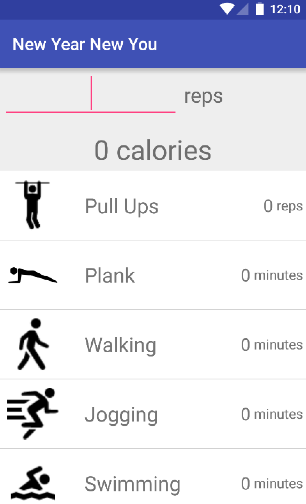
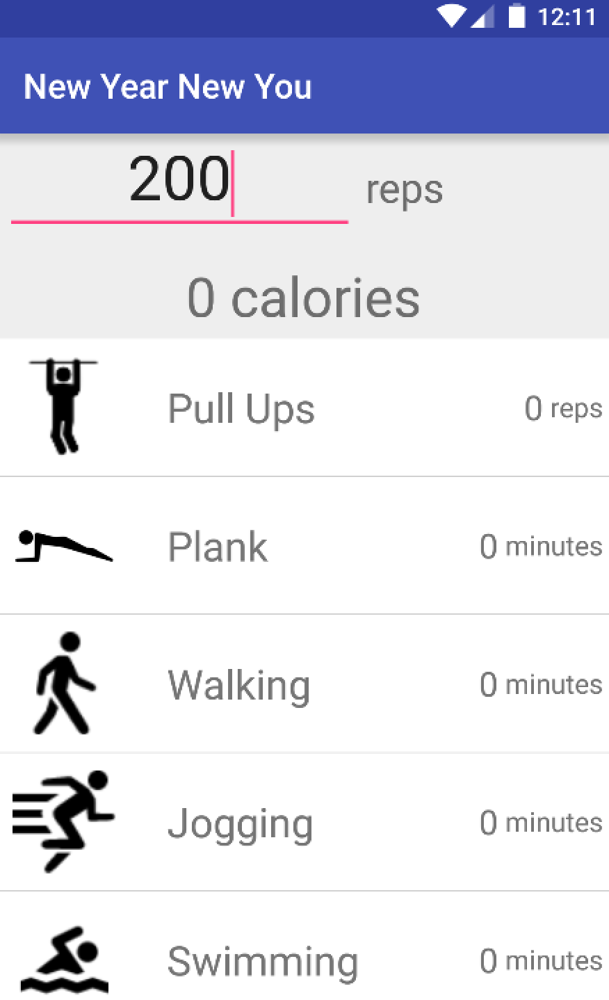
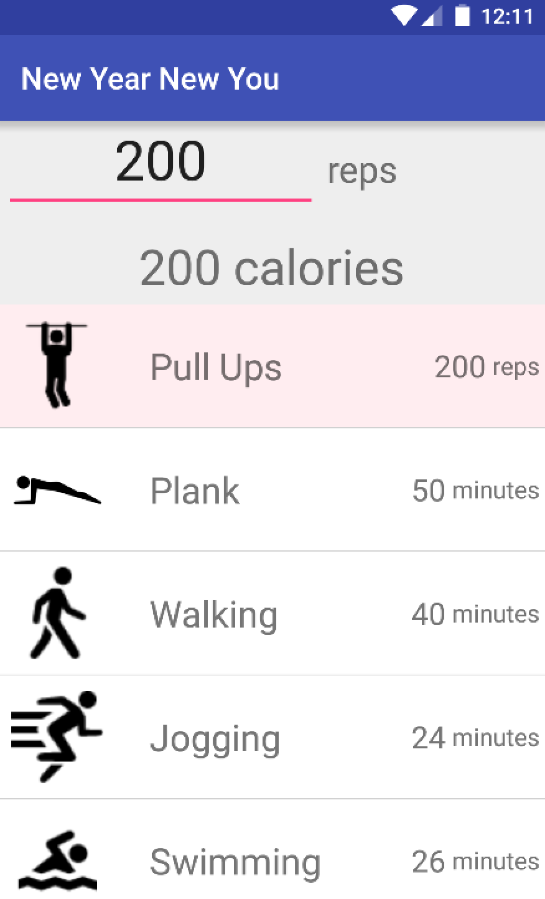
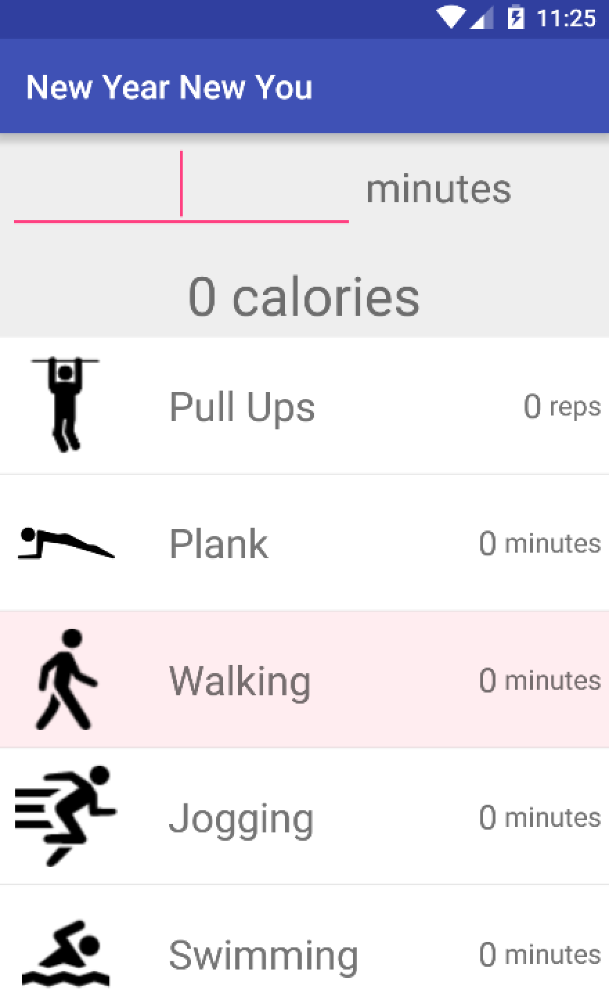
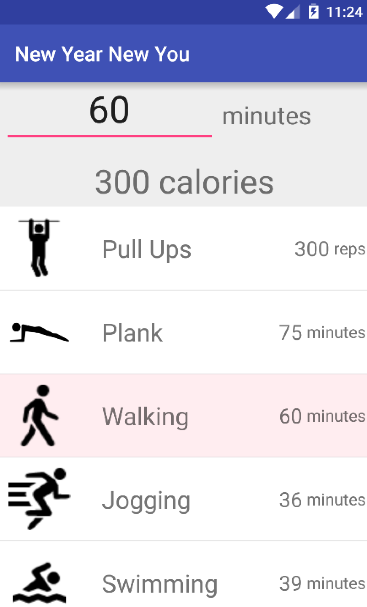

# PROG 01: Crunch Time

New Year New You is the new way to exercise. With this app, you can choose your favorite activity, see how many calories you'll burn doing it, and try out some new exercises that burn the same amount of calories.

## Authors

Ekaterina Stukalova ([katya.stukalova@berkeley.edu](mailto:katya.stukalova@berkeley.edu))

## Demo Video

See [New Year New You in action!] (https://link_to_your_video)

## Screenshots
Select the number of repetitions or minutes and then select your activity:  
  
  
  
Select your activity and then the number of repetitons or minutes:  
  
  
  
## Acknowledgments

Skeleton code for list adapter was borrowed from: [vogella] GmbH (http://www.vogella.com/tutorials/AndroidListView/article.html)
